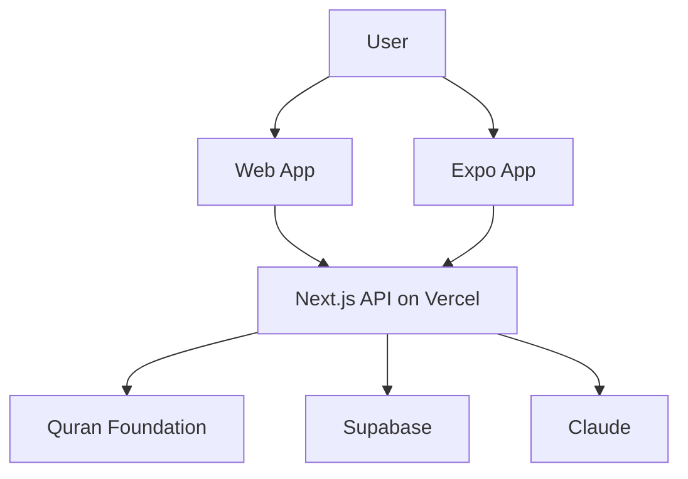

# Qalb — Your Daily Quran Companion

**Connect your daily life to the Quran with AI-powered discovery, reading, reflection, and habits that last beyond Ramadan.**

## See Qalb in action

Four moments that show how Qalb helps someone move from “I want to be closer to the Quran” to a daily habit—in one companion, not five different apps.

### 1. Discover — ayat for what is on your heart

**Route:** [`/discover`](https://qalb-fawn.vercel.app/discover)

**Scene:** You have had a difficult week and want the Quran to speak to your situation—not sure which surah to open.

1. You describe what you are going through in your own words.
2. Qalb searches the Quran Foundation corpus, then ranks relevant ayat with a short, gentle explanation.
3. You open any result to read Arabic, translation, and tafsir—and save the moment to your Journey.

**Try it:** [Open Discover →](https://qalb-fawn.vercel.app/discover)

---

### 2. Read & Mushaf — build a daily reading rhythm

**Route:** [`/read`](https://qalb-fawn.vercel.app/read)

**Scene:** Ramadan reminded you how good it feels to read the Quran; now you want ten quiet minutes each evening, without losing your place.

1. Home or Read picks up **continue reading** where you stopped last time.
2. You read ayah-by-ayah with translation, or switch to **mushaf page mode** (pages 1–604) for a traditional layout.
3. You tap play on any ayah to hear recitation, and your position syncs when you sign in.

**Try it:** [Open Read →](https://qalb-fawn.vercel.app/read)

---

### 3. Understand & reflect — go deeper than a quote

**Route:** [`/verse/2:255`](https://qalb-fawn.vercel.app/verse/2:255) _(example ayah)_

**Scene:** Discover or Read surfaced an ayah that moved you; you want meaning, not just a screenshot to share.

1. You open the verse page with Arabic, translation, and your chosen **tafsir** source.
2. **Reflect** offers guided prompts to journal what this ayah means for you today.
3. **Chat** lets you ask questions in context—alongside classical tafsir, never replacing a scholar.

**Try it:** [Open Ayat al-Kursi →](https://qalb-fawn.vercel.app/verse/2:255)

---

### 4. Journey & habits — stay consistent after Ramadan

**Routes:** [`/journey`](https://qalb-fawn.vercel.app/journey) · [`/goals`](https://qalb-fawn.vercel.app/goals) · [`/hifz`](https://qalb-fawn.vercel.app/hifz)

**Scene:** Shawwal has begun; you do not want the Quran to become “last month’s app.”

1. **Journey** gathers your discover queries, reflections, key themes, and verse chats in one timeline.
2. You set a **goal** or keep a **streak** so small daily steps feel achievable, not overwhelming.
3. **Hifz** and **Khatm** track memorization and completion with spaced repetition—progress follows you when signed in.

**Try it:** [Open Journey →](https://qalb-fawn.vercel.app/journey)

---

|                           |                                                                                                           |
| ------------------------- | --------------------------------------------------------------------------------------------------------- |
| **Live demo**             | https://qalb-fawn.vercel.app/                                                                             |
| **Hackathon**             | [Quran Foundation Hackathon](https://launch.provisioncapital.com/quran-hackathon) (deadline May 20, 2026) |
| **Deep technical design** | [docs/LOW_LEVEL_DESIGN.md](docs/LOW_LEVEL_DESIGN.md)                                                      |

<!-- Fill before submission -->

| **Team** | _Add team member names_ |
| **Demo video (2–3 min)** | _Add YouTube/Loom URL_ |
| **Repository** | _Add public GitHub URL if applicable_ |

---

## The problem

During Ramadan, millions of Muslims reconnect with the Quran — through taraweeh, daily readings, and renewed intention. After Ramadan, that momentum often fades: life gets busy, apps feel fragmented (read here, listen there, search elsewhere), and it is hard to find verses that speak to _today’s_ worries without already knowing where to look.

Qalb addresses three gaps:

1. **Relevance** — Life situations (anxiety, gratitude, loss, hope) should map to Quranic guidance without requiring scholarly search skills.
2. **Continuity** — Reading, listening, reflecting, and tracking progress should feel like one journey, not disconnected tools.
3. **Habit** — Engagement should persist after Ramadan via goals, streaks, memorization (Hifz), and khatm planning — with optional sign-in so progress follows the user across devices.

---

## Our approach

Qalb is a full-stack Quran companion: **web** (Next.js) and **mobile** (Expo), backed by **Quran Foundation APIs**, optional **cloud sync** (Supabase), and **grounded AI** (Anthropic) for discovery and reflection — never as a substitute for scholars or tafsir, but as a bridge when you do not know where to start.

### Product pillars

| Pillar         | What it does                                                                                   |
| -------------- | ---------------------------------------------------------------------------------------------- |
| **Connect**    | Discover verses from a life situation; daily “letter to your heart”; search                    |
| **Understand** | Read (verse list + mushaf pages), verse detail with tafsir and translations, AI reflect & chat |
| **Practice**   | Full-surah listen, header radio, Makkah/Madinah live TV, prayer times & adhan                  |
| **Retain**     | Journey history, goals, streaks, Hifz (spaced repetition), Khatm, gamification                 |
| **Extend**     | Hadith reader, library collections, profile & settings                                         |

### Features by route

| Route                   | Description                                                             |
| ----------------------- | ----------------------------------------------------------------------- |
| `/`                     | Home — surah browser, continue reading, daily letter                    |
| `/discover`             | “What’s on your mind?” → ranked verses with explanations                |
| `/read`                 | Surah reading + **mushaf** page mode (1–604), translations, verse audio |
| `/verse/[verseKey]`     | Deep dive — tafsir, reflect, streaming verse chat                       |
| `/journey`              | Key themes, discover history, reflections, chats                        |
| `/listen`               | Reciter-first full surah MP3 with global mini-player                    |
| `/live`                 | HLS live Quran TV (Makkah/Madinah-style channels)                       |
| `/ahadith/*`            | Hadith books → chapters → bilingual sections                            |
| `/library`              | Bookmarks and collections                                               |
| `/goals`                | Reading/memorization goals                                              |
| `/hifz`                 | Memorization with SM-2 spaced repetition                                |
| `/khatm`                | Khatm cycle tracking                                                    |
| `/profile`, `/settings` | Progress, preferences, sign-in                                          |

Mobile parity for core flows: see [MOBILE_PARITY.md](MOBILE_PARITY.md).

---

## Hackathon judging alignment

Projects are scored out of 100 points ([official criteria](https://launch.provisioncapital.com/quran-hackathon)). How Qalb maps to each:

| Criterion                      | Points | How Qalb addresses it                                                                              |
| ------------------------------ | ------ | -------------------------------------------------------------------------------------------------- |
| **Impact on Quran engagement** | 30     | Discover + Journey + goals/streaks/Hifz/Khatm; explicit post-Ramadan habit framing                 |
| **Product quality & UX**       | 20     | Mushaf mode, multiple translations/tafsir sources, cohesive design system, web + Expo parity       |
| **Technical execution**        | 20     | Layered architecture, Vitest-tested `lib/`, structured API routes, audio-focus arbitration         |
| **Innovation & creativity**    | 15     | Search-grounded AI Discover, dual HLS prewarm for live TV, unified journey across modalities       |
| **Effective use of APIs**      | 15     | Deep Content + User API integration (see below); [full inventory in LLD](docs/LOW_LEVEL_DESIGN.md) |

---

## Quran Foundation API usage

Hackathon rules require **at least one Content API** and **at least one User API**. Qalb uses both extensively through server-side adapters (secrets never exposed to the client).

### Content API

Implemented in [`lib/quran-api.js`](lib/quran-api.js), exposed via `app/api/verse/*`, `app/api/quran/*`, and `app/api/search`:

- **Chapters & metadata** — chapters, juz, hizb, translation lists
- **Verses** — by chapter (paginated), by mushaf page, by key, daily/random
- **Search** — full-text search (powers Discover prefetch and global search)
- **Tafsir** — multiple tafsir sources per verse/chapter
- **Audio** — verse-level recitation with reciter fallback chain
- **Translations** — multiple translation resources on read and verse detail

Example proxy endpoints:

```
GET /api/verse/by-key?key=2:255&translation=20
GET /api/verse/by-page?page=1&translation=20
GET /api/search?q=patience
GET /api/verse/tafsir?key=2:255&tafsirId=169
GET /api/verse/audio?key=2:255&reciter=7
```

### User API

Implemented in [`lib/user-api.js`](lib/user-api.js), with OAuth2 PKCE via [`lib/auth.js`](lib/auth.js):

- **Authentication** — Quran Foundation sign-in (web NextAuth; mobile deep-link JWT)
- **Bookmarks** — `GET/POST/DELETE /api/user/bookmark`
- **Notes** — `GET/POST/PATCH/DELETE /api/user/notes`
- **Goals** — `GET/POST/PATCH/DELETE /api/user/goals`
- **Streaks** — `GET /api/user/streak`

The adapter also implements **collections**, **reading_sessions**, **activity_days**, and **preferences** for future UI expansion.

### Cloud sync (complement to User API)

Signed-in users sync rich local state (reading progress, reflections, Hifz, khatm, etc.) to Supabase `app_user_storage` namespaces via [`lib/user-app-sync-bridge.js`](lib/user-app-sync-bridge.js) and `GET/PATCH /api/user/app-storage/[namespace]`. This complements Foundation User APIs where blob-shaped app state is more efficient than per-field CRUD.

### Other integrations (supplementary)

| Integration        | Use                                                            |
| ------------------ | -------------------------------------------------------------- |
| **MP3Quran**       | `/api/audio/*`, `/api/live/tv` — reciters, radio, live HLS     |
| **Anthropic**      | `/api/ai/*` — discover, reflect, chat, summaries, daily letter |
| **Hadith sources** | `/api/hadith/*` — books and sections (not Foundation)          |

---

## Architecture snapshot



Qalb follows a **five-layer model** (UI → client bridges → domain `lib/` → adapters → API routes). Summary: [ARCHITECTURE.md](ARCHITECTURE.md).

For sequence diagrams, route tables, sync semantics, and audio arbitration, see **[Low-Level Design](docs/LOW_LEVEL_DESIGN.md)**.

---

## Tech stack

| Layer         | Technology                                 |
| ------------- | ------------------------------------------ |
| Web framework | Next.js 16 (App Router), React 19          |
| Styling       | Tailwind CSS v4, shadcn/Base UI components |
| Auth          | NextAuth + Quran Foundation OAuth2 PKCE    |
| Database      | Supabase (Postgres, RLS)                   |
| AI            | Anthropic Claude API                       |
| Mobile        | Expo (`qalb_mobile/`)                      |
| Tests         | Vitest                                     |
| Deploy        | Vercel                                     |

### Repository layout

```
app/              # Pages (Server + Client components)
app/api/          # BFF API routes
components/       # Shared UI
lib/              # Domain logic, adapters, tests
qalb_mobile/      # Expo app
supabase/         # Migrations and schema docs
docs/             # LOW_LEVEL_DESIGN.md
```

---

## Getting started

### Web

```bash
npm install
cp .env.example .env.local   # if present; otherwise create .env.local
npm run dev                  # http://localhost:3000
npm test                     # run Vitest suite
```

**Environment variables** (names only — obtain from Quran Foundation and your providers):

```env
QURAN_CLIENT_ID=
QURAN_CLIENT_SECRET=
QURAN_OAUTH_ENDPOINT=https://oauth2.quran.foundation
QURAN_API_BASE=https://apis.quran.foundation
ANTHROPIC_API_KEY=
NEXTAUTH_SECRET=
NEXT_PUBLIC_APP_URL=http://localhost:3000
SUPABASE_URL=
SUPABASE_SERVICE_ROLE_KEY=
```

`NEXT_PUBLIC_APP_URL` must match your deployment origin for server-side fetches (verse pages, live channel list).

### Mobile

```bash
cd qalb_mobile
npm install
# Set EXPO_PUBLIC_API_BASE_URL to your machine LAN IP or Vercel URL (not localhost on device)
npx expo start
```

See [MOBILE_PARITY.md](MOBILE_PARITY.md) and [MOBILE_SECURITY.md](MOBILE_SECURITY.md).

### Smoke-test APIs locally

```bash
curl http://localhost:3000/api/verse/daily
curl "http://localhost:3000/api/verse/by-key?key=2:255&translation=85"
curl "http://localhost:3000/api/search?q=patience"
curl -X POST http://localhost:3000/api/ai/discover \
  -H "Content-Type: application/json" \
  -d '{"situation":"I am feeling anxious about the future"}'
```

---

## Future scope

### Derived roadmap (from codebase direction)

- **Full User API surface in UI** — wire collections, `reading_sessions`, and `activity_days` end-to-end (adapters already exist).
- **Community & family** — shared collections and group goals on top of sync namespaces.
- **Offline-first** — downloaded mushaf pages and audio; background sync when online.
- **Push notifications** — streak reminders and goal nudges (web push scaffold exists).
- **Accessibility** — screen-reader polish, reading scale, dyslexia-friendly modes.
- **Educator mode** — parent/teacher dashboards for Hifz and Khatm progress.
- **Quran MCP** — optional curation/admin tools alongside Search API grounding.

### Our roadmap _(customize before submission)_

- _Your vision bullet 1_
- _Your vision bullet 2_
- _Your vision bullet 3_

### Benefits for the ummah

- **Lower the barrier** — Anyone can start from a real-life situation instead of knowing surah names by heart.
- **Respect tradition** — Tafsir sources and translations from Quran Foundation; AI explains and prompts, not replaces scholarship.
- **Sustain habit** — Streaks, goals, Hifz, and Journey make post-Ramadan continuity tangible.
- **Meet people where they are** — Web and mobile, read and listen and watch live, in one companion.
- **Own your data** — Sign-in syncs progress; open stack can be extended by masjids and educators.

---

## Documentation index

| Document                                             | Contents                                      |
| ---------------------------------------------------- | --------------------------------------------- |
| [docs/LOW_LEVEL_DESIGN.md](docs/LOW_LEVEL_DESIGN.md) | Flows, API inventory, state model, deployment |
| [ARCHITECTURE.md](ARCHITECTURE.md)                   | Layer overview                                |
| [MOBILE_PARITY.md](MOBILE_PARITY.md)                 | Web ↔ mobile route map                        |
| [MOBILE_SECURITY.md](MOBILE_SECURITY.md)             | Mobile auth and secrets boundary              |
| [supabase/README.md](supabase/README.md)             | Database and sync namespaces                  |

---

## License & attribution

Built for the [Quran Foundation Hackathon](https://launch.provisioncapital.com/quran-hackathon) by Provision Launch. Quran text, translations, tafsir, and audio via [Quran Foundation APIs](https://api-docs.quran.foundation/). Listen/Live supplementary audio via [MP3Quran](https://www.mp3quran.net/eng/api).
