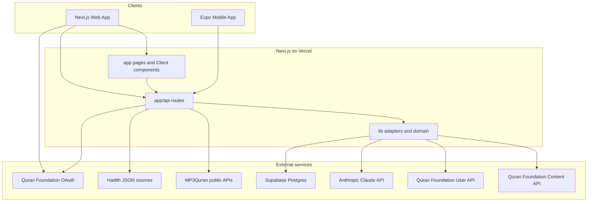
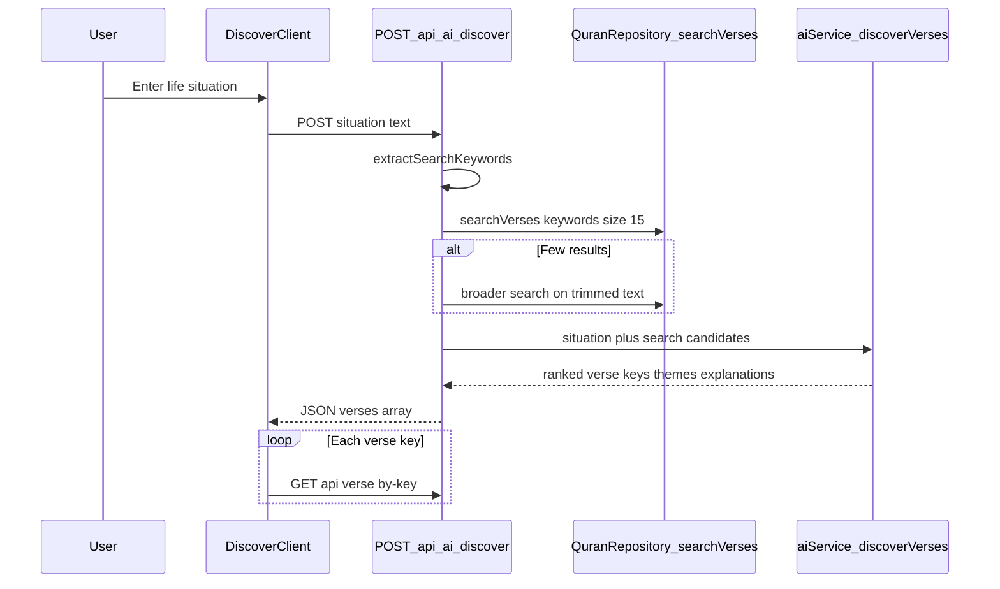
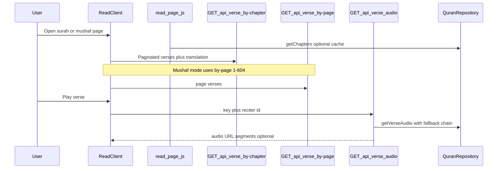
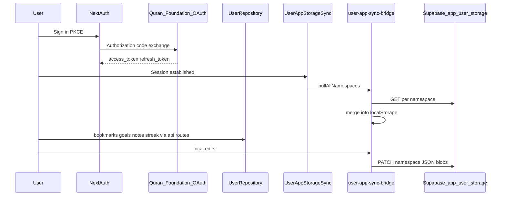
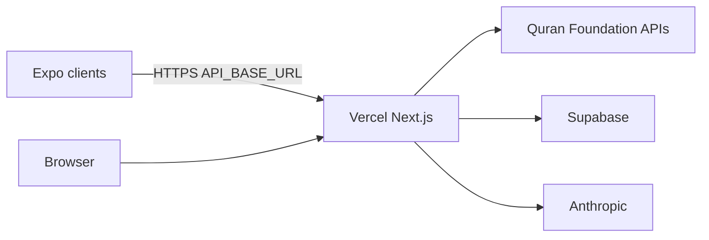

# Qalb — Low-Level Design

Technical design reference for developers and hackathon judges. For product context, problem statement, and submission checklist, see [README.md](../README.md).

## 1. Purpose and scope

**In scope:** Next.js web app, `app/api` BFF layer, framework-agnostic `lib/` domain logic, Expo mobile client (`qalb_mobile/`), and integrations with Quran Foundation, Supabase, Anthropic, and MP3Quran.

**Out of scope:** Full prompt text line-by-line, UI component styling tokens, and operational runbooks beyond deployment env vars.

---

## 2. System context

| Actor / system     | Role                                                                                        |
| ------------------ | ------------------------------------------------------------------------------------------- |
| Browser            | Renders App Router pages; holds guest `localStorage`; NextAuth session when signed in       |
| Expo               | Proxies all Quran/AI/user calls through deployed Next origin; AsyncStorage mirrors web keys |
| Next API routes    | Auth gate, validation, logging (`withLoggedRoute`), no secrets in client bundles            |
| `lib/quran-api.js` | Client-credentials OAuth for Content API; `QuranRepository` static methods                  |
| `lib/user-api.js`  | User Bearer token calls to `/api/v1/*`                                                      |
| Supabase           | `app_user_storage` namespaces, profile, activity heatmap, gamification sync                 |
| Claude             | Discover ranking, reflect prompts, verse chat, read summaries, daily letter                 |
| MP3Quran           | Reciter surah MP3s, radio streams, live TV HLS URLs (proxied, not Foundation)               |

---

## 3. Layered architecture

Executive summary lives in [ARCHITECTURE.md](../ARCHITECTURE.md). Layers bottom-up:

| Layer                | Location                                                                                    | Responsibility                                                            |
| -------------------- | ------------------------------------------------------------------------------------------- | ------------------------------------------------------------------------- |
| **UI**               | `app/**`, `components/**`                                                                   | Render, route-level layout, local UI state                                |
| **Client bridges**   | `lib/useGamification.js`, `lib/user-app-sync-bridge.js`, `components/UserAppStorageSync.js` | Session-aware orchestration over storage + server sync                    |
| **Domain utilities** | `lib/*.js` (pure helpers)                                                                   | Goals progress, spaced repetition, merges, calendar keys — Vitest-covered |
| **Adapters**         | `lib/quran-api.js`, `lib/user-api.js`, `lib/claude.js`, `lib/supabase-*`                    | HTTP/OAuth/SDKs; server-safe                                              |
| **API routes**       | `app/api/**/route.js`                                                                       | Input validation, delegate to adapters, structured errors                 |

### Server vs client split

Most interactive routes use a **Server Component shell** + **Client Component**:

- Example: `app/read/page.js` (SSR chapter list) → `app/read/ReadClient.js` (infinite scroll, audio, mushaf toggle).
- Verse detail: `app/verse/[verseKey]/page.js` → `VerseDetailClient.js` (tafsir tabs, reflect, streaming chat).

Server pages call `QuranRepository` directly where initial data is needed at build/ISR time. Client code calls same-origin `/api/*` routes so OAuth client secrets never ship to the browser.

---

## 4. Core data flows

### 4.1 Discover (AI + Content API)

Implementation: [`app/api/ai/discover/route.js`](../app/api/ai/discover/route.js), [`lib/claude.js`](../lib/claude.js), [`lib/prompts.js`](../lib/prompts.js).

Discover is **search-grounded**: Claude ranks from Quran Foundation search results, reducing hallucinated verse references. History is appended locally via [`lib/qalb-discover-history.js`](../lib/qalb-discover-history.js) and surfaced on `/journey`.

### 4.2 Read (Content API + optional verse audio)

- Verse list mode: infinite scroll batches via `/api/verse/by-chapter`.
- Mushaf mode: `/api/verse/by-page?page=1..604`.
- Progress: `qalb_reading_progress` → Supabase namespace `reading_progress` when signed in ([`lib/user-app-sync-bridge.js`](../lib/user-app-sync-bridge.js)).

### 4.3 Auth and cross-device sync

- Auth config: [`lib/auth.js`](../lib/auth.js) → [`app/api/auth/[...nextauth]/route.js`](../app/api/auth/[...nextauth]/route.js).
- Namespaces: [`lib/constants/app-user-storage.js`](../lib/constants/app-user-storage.js).
- Mobile: JWT from [`app/api/mobile/auth-complete/route.js`](../app/api/mobile/auth-complete/route.js) + Bearer on `/api/user/*` ([`MOBILE_SECURITY.md`](../MOBILE_SECURITY.md)).

### 4.4 Audio coexistence (Listen, Live, Adhan)

Multiple playback sources share one browser audio context. [`lib/audio-focus.js`](../lib/audio-focus.js) arbitrates:

- Entering `/live` pauses global Quran MP3/radio player.
- Starting Quran playback mutes live HLS (dual-prewarm in [`lib/live-dual-prewarm.js`](../lib/live-dual-prewarm.js)) and stops adhan ([`lib/prayer-adhan.js`](../lib/prayer-adhan.js)).
- Global listen/radio state: [`lib/quran-audio-player.js`](../lib/quran-audio-player.js).

---

## 5. API surface inventory

### 5.1 Quran Foundation Content API (via `QuranRepository`)

| Repository method                                           | Upstream path (v4)                               | App proxy                             |
| ----------------------------------------------------------- | ------------------------------------------------ | ------------------------------------- |
| `getChapters`                                               | `/content/api/v4/chapters`                       | `GET /api/quran/chapters`             |
| `getChapter`                                                | `/content/api/v4/chapters/{id}`                  | `GET /api/quran/chapters/[chapterId]` |
| `getVersesByChapter`                                        | `/content/api/v4/verses/by_chapter/{id}`         | `GET /api/verse/by-chapter`           |
| `getVersesByPage`                                           | `/content/api/v4/verses/by_page/{page}`          | `GET /api/verse/by-page`              |
| `getVerseByKey`                                             | `/content/api/v4/verses/by_key/{key}`            | `GET /api/verse/by-key`               |
| `getRandomVerse`                                            | `/content/api/v4/verses/random`                  | `GET /api/verse/daily`                |
| `searchVerses`                                              | `/content/api/v4/search`                         | `GET /api/search`                     |
| `getReciters`                                               | `/content/api/v4/resources/recitations`          | (used inside verse audio)             |
| `getVerseAudio`                                             | `/content/api/v4/recitations/{id}/by_ayah/{key}` | `GET /api/verse/audio`                |
| `getTafsirList` / `getTafsirByChapter` / `getTafsirByVerse` | `/content/api/v4/tafsirs/...`                    | `GET /api/verse/tafsir`               |
| `getTranslationList`                                        | `/content/api/v4/resources/translations`         | `GET /api/quran/translations`         |
| `getJuzList`                                                | `/content/api/v4/juzs`                           | `GET /api/quran/juz`                  |
| `getHizbs`                                                  | `/content/api/v4/hizbs`                          | `GET /api/quran/hizbs`                |

Content OAuth: client credentials to `{QURAN_OAUTH_ENDPOINT}/oauth2/token` with `scope=content` ([`lib/quran-api.js`](../lib/quran-api.js)).

`/api/verse/audio` adds a **reciter fallback chain** (user pick, then IDs `7, 2, 1, 3, 6, 10`) and optional segment synthesis when the API omits segments.

### 5.2 Quran Foundation User API (via `UserRepository`)

| Repository method                                       | Upstream path                   | App proxy                                                |
| ------------------------------------------------------- | ------------------------------- | -------------------------------------------------------- |
| `getStreak`                                             | `GET /api/v1/streaks`           | `GET /api/user/streak`                                   |
| `getActivity`                                           | `GET /api/v1/activity_days`     | (adapter; partial UI wiring)                             |
| `recordReadingSession`                                  | `POST /api/v1/reading_sessions` | (adapter; not all flows call)                            |
| `getGoals` / `createGoal` / `updateGoal` / `deleteGoal` | `/api/v1/goals`                 | `GET/POST/PATCH/DELETE /api/user/goals`                  |
| `getBookmarks` / `addBookmark` / `removeBookmark`       | `/api/v1/bookmarks`             | `GET/POST/DELETE /api/user/bookmark`                     |
| `getCollections` / CRUD                                 | `/api/v1/collections`           | (adapter; local library uses sync namespaces)            |
| `getNotes` / CRUD                                       | `/api/v1/notes`                 | `GET/POST/PATCH/DELETE /api/user/notes`                  |
| `getPreferences` / `updatePreferences`                  | `/api/v1/preferences`           | (adapter; theme/reciter also in `preferences` namespace) |

User calls require the signed-in user's OAuth **access token** (session or mobile JWT). Base URL: `QURAN_PRELIVE_API_BASE` with fallback to `QURAN_API_BASE`.

### 5.3 Supabase-backed user routes (complement to User API)

| Route                                         | Purpose                             |
| --------------------------------------------- | ----------------------------------- |
| `GET/PATCH /api/user/app-storage/[namespace]` | Merge-sync JSON blobs per namespace |
| `GET/PATCH /api/user/profile`                 | Display profile metadata            |
| `POST /api/user/activity`                     | Activity heatmap events             |
| `GET/PATCH /api/user/gamification`            | XP, badges, streaks local merge     |

### 5.4 AI routes (Anthropic; grounded where noted)

| Route                       | Mode                | Grounding                        |
| --------------------------- | ------------------- | -------------------------------- |
| `POST /api/ai/discover`     | JSON                | Quran search prefetch            |
| `POST /api/ai/reflect`      | JSON                | Verse context in body            |
| `POST /api/ai/chat`         | `text/plain` stream | Verse key + tafsir snippet       |
| `POST /api/ai/read-summary` | stream              | Page/chapter verse batch         |
| `POST /api/ai/daily-letter` | stream              | Optional recent activity context |

### 5.5 Supplementary (not Quran Foundation)

| Route                            | Upstream / source               |
| -------------------------------- | ------------------------------- |
| `GET /api/audio/reciters`        | mp3quran.net v3                 |
| `GET /api/audio/radios`          | mp3quran.net v3                 |
| `GET /api/live/tv`               | mp3quran.net live TV            |
| `GET /api/hadith/*`              | Bundled/API hadith editions     |
| `GET /api/prayer/times`          | Prayer time calculation libs    |
| `POST /api/push/subscribe`       | Web push subscriptions          |
| `GET /api/cron/streak-reminders` | Scheduled reminders (protected) |
| `GET /api/mobile/auth-complete`  | Mobile OAuth handoff            |

---

## 6. Client state model

### 6.1 localStorage (guest and signed-in)

| Key / module                                  | Purpose                     |
| --------------------------------------------- | --------------------------- |
| `qalb_reading_progress`                       | Last surah/page position    |
| `qalb_bookmarks`                              | Verse bookmarks map         |
| `qalb_reflections`, `qalb_notes`, `qalb_chat` | Verse-level journaling      |
| `qalb_discover_history`                       | Recent Discover queries     |
| `qalb_read_key_themes`                        | AI surah theme cache        |
| `qalb_reciter_id`, `qalb_theme`               | Preferences                 |
| `qalb_time_tracking`                          | Per-day minutes for heatmap |
| `qalb_gamification_{userId\|guest}`           | XP and badges               |
| `qalb_last_reads`, `qalb_last_hadith_reads`   | Continue-reading chips      |

Canonical exports: [`lib/qalb-storage-keys.js`](../lib/qalb-storage-keys.js), [`lib/qalb-verse-local-keys.js`](../lib/qalb-verse-local-keys.js), [`lib/user-app-sync-bridge.js`](../lib/user-app-sync-bridge.js).

### 6.2 Journey refresh

Same-tab updates dispatch `qalb_journey_local_updated` ([`lib/qalb-journey-events.js`](../lib/qalb-journey-events.js)) because the `storage` event does not fire in the originating tab.

### 6.3 Guest vs signed-in

| Concern              | Guest                   | Signed-in                                                          |
| -------------------- | ----------------------- | ------------------------------------------------------------------ |
| Read/bookmarks/notes | `localStorage` only     | Merge with Supabase namespaces + optional User API bookmarks/notes |
| Streaks (Foundation) | Local gamification only | `/api/user/streak` + sync                                          |
| OAuth                | Optional                | Required for cloud sync and User API writes                        |

---

## 7. Mobile architecture

- **Navigator:** tab + stack in `qalb_mobile/src/navigation/AppNavigator.js`.
- **API base:** `EXPO_PUBLIC_API_BASE_URL` → deployed Next origin ([`qalb_mobile/src/config.js`](../qalb_mobile/src/config.js)).
- **No Content API secrets in the bundle** — all Quran calls hit Next proxies ([`MOBILE_SECURITY.md`](../MOBILE_SECURITY.md)).
- **Auth:** in-app browser → `/api/mobile/auth-complete` → deep link with JWT → `Authorization: Bearer` ([`qalb_mobile/src/lib/api-with-auth.js`](../qalb_mobile/src/lib/api-with-auth.js)).
- **Storage parity:** AsyncStorage keys align with web; sync via `/api/user/app-storage/{namespace}`.

Full route mapping: [MOBILE_PARITY.md](../MOBILE_PARITY.md).

---

## 8. AI design notes

1. **Discover:** Keyword extraction → `searchVerses` (15, then broadened) → Claude ranks and explains. Client hydrates full ayah text via `/api/verse/by-key`.
2. **Streaming:** Chat, read-summary, and daily-letter return `ReadableStream` bodies for progressive UI.
3. **Prompts:** Centralized in [`lib/prompts.js`](../lib/prompts.js); facade in [`lib/claude.js`](../lib/claude.js).
4. **Reliability:** Discover intentionally uses Search API + Claude rather than MCP-only retrieval, which proved flaky on some API tiers during development.

---

## 9. Cross-cutting concerns

| Concern      | Approach                                                                                              |
| ------------ | ----------------------------------------------------------------------------------------------------- |
| **Security** | Server-only `QURAN_CLIENT_SECRET`; mobile JWT scoped claim `qalb_mobile`; Supabase RLS on user tables |
| **Logging**  | `withLoggedRoute`, structured `apiLog` / `userApiLog`                                                 |
| **Errors**   | User API 404 → `null`; verse audio reciter fallback; AI routes return 4xx/503 with safe messages      |
| **Testing**  | Vitest on pure `lib/` modules (`lib/__tests__/`); `npm test` required before merge                    |
| **Caching**  | Next.js `fetch` cache/revalidate on select server pages (chapters, live channel list)                 |

---

## 10. Deployment topology

**Required env vars (names only):**

- `QURAN_CLIENT_ID`, `QURAN_CLIENT_SECRET`, `QURAN_OAUTH_ENDPOINT`, `QURAN_API_BASE`
- `ANTHROPIC_API_KEY`
- `NEXTAUTH_SECRET`, `NEXT_PUBLIC_APP_URL`
- `SUPABASE_URL`, `SUPABASE_SERVICE_ROLE_KEY` (server)
- Mobile: `EXPO_PUBLIC_API_BASE_URL` matching `NEXT_PUBLIC_APP_URL`

Migrations: [`supabase/migrations/`](../supabase/migrations/) — see [supabase/README.md](../supabase/README.md).

Production demo: https://qalb-fawn.vercel.app/

---

## 11. Known limitations

1. **Content API 403** — Some recitation/resource endpoints may 403 in certain environments; Listen falls back to MP3Quran; verse audio uses a fixed reciter ID set with fallback chain.
2. **User API coverage** — `UserRepository` implements collections, `reading_sessions`, and `activity_days`, but not every method has a dedicated UI route yet; many flows use Supabase namespaces for speed of iteration.
3. **Rate limiting** — AI routes omit production rate limits (noted in discover route comments); add Upstash or similar before wide public launch.
4. **Hadith / Live / Listen** — Supplementary sources; eligibility for the hackathon rests on Quran Foundation Content + User APIs documented above.

---

## Related documents

- [README.md](../README.md) — product overview and hackathon alignment
- [ARCHITECTURE.md](../ARCHITECTURE.md) — layer summary
- [MOBILE_PARITY.md](../MOBILE_PARITY.md) — web ↔ mobile route map
- [MOBILE_SECURITY.md](../MOBILE_SECURITY.md) — OAuth and RLS
- [supabase/README.md](../supabase/README.md) — schema and storage
